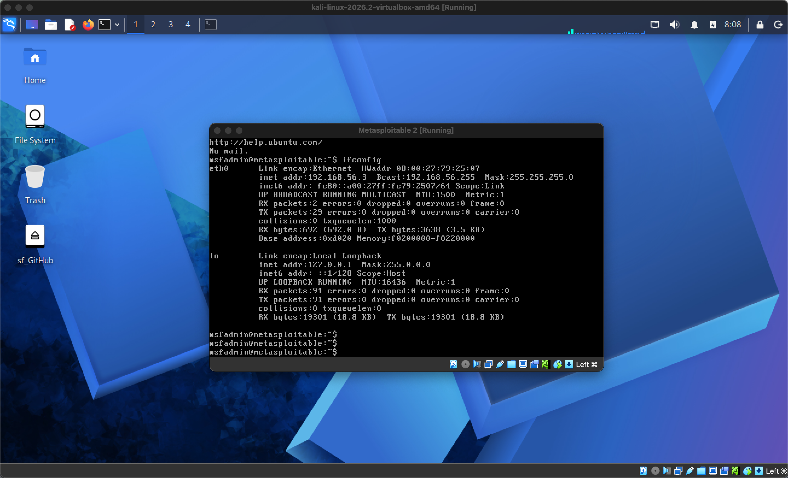
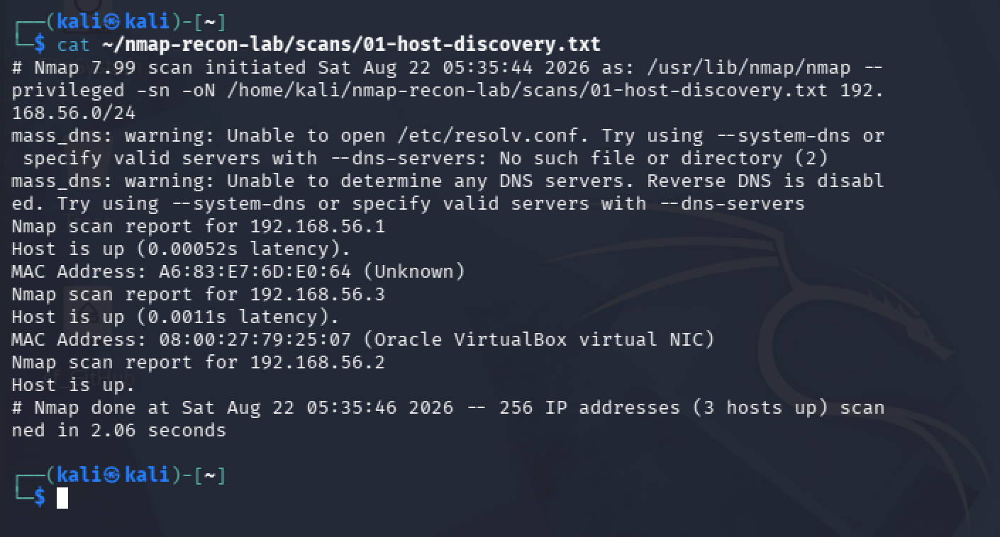
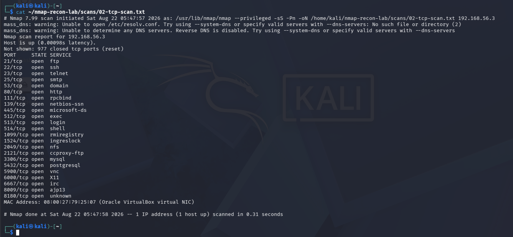
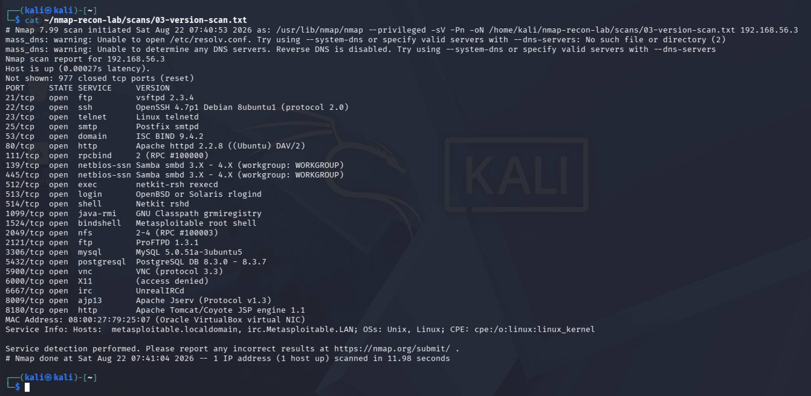
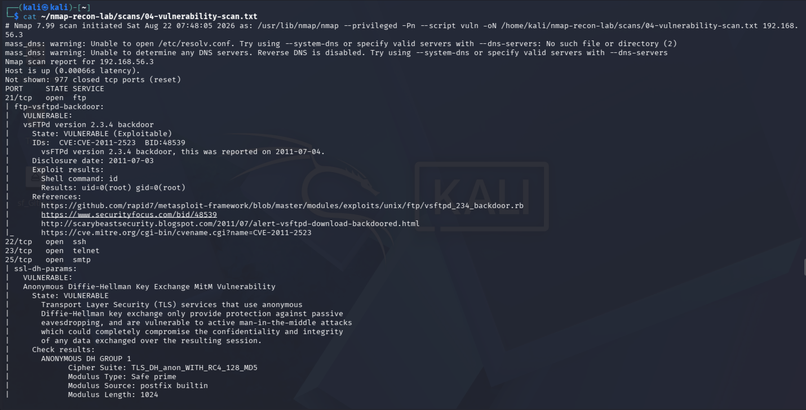

# Nmap Recon Lab

Professional network reconnaissance laboratory built in an isolated VirtualBox environment using Kali Linux and Metasploitable 2. The project demonstrates a complete reconnaissance workflow from host discovery to vulnerability assessment.

> **Ethical Notice**
> All scans were performed exclusively against my own intentionally vulnerable laboratory machines. No public systems or unauthorized networks were scanned.

---

## Lab Overview



**Attacker:** Kali Linux 2026.2

**Target:** Metasploitable 2

**Network:** Host-only (192.168.56.0/24)

---

## Methodology

1. Host discovery
2. TCP port enumeration
3. Service & version detection
4. NSE vulnerability assessment
5. Risk analysis and reporting

---

## Scan Results

### Host Discovery



Three active hosts were identified on the isolated laboratory network, including the Metasploitable target at **192.168.56.3**.

### TCP Port Enumeration



A SYN scan identified 23 exposed TCP services including FTP, SSH, HTTP, SMB, MySQL, PostgreSQL and Tomcat.

### Service & Version Detection



Service fingerprinting identified legacy software versions suitable for security assessment and vulnerability research.

### NSE Vulnerability Assessment



Nmap Scripting Engine detected multiple security issues, including the well-known **vsFTPd 2.3.4 backdoor** and several legacy service exposures.

---

## Key Findings

| Port | Service | Severity |
|------|---------|----------|
| 21 | vsFTPd 2.3.4 | Critical |
| 23 | Telnet | High |
| 139/445 | Samba | High |
| 1524 | Root Bind Shell | Critical |
| 3306 | MySQL | Medium |
| 8180 | Apache Tomcat | Medium |

A detailed technical report is available in `report/nmap-recon-report.md`.

---

## Repository Structure

```text
nmap-recon-lab/
├── README.md
├── scans/
├── screenshots/
├── report/
└── diagrams/
```

---

## Skills Demonstrated

- Network Reconnaissance
- Nmap
- TCP/IP Enumeration
- Service Fingerprinting
- NSE Scripting
- Vulnerability Assessment
- Technical Reporting
